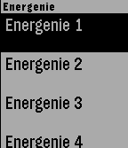

# Energenie controller APP



Toggle Energenie smart sockets from your wrist.

    Pebble (C) --kitjs--> Pebble(JS) --request--> RaspberryPI --radio--> Energenie

Requires external hardware/software to convert API requests into radio signals compatible with Energenie (aka Raspberry PI):
[Link to webapp for Energenie](https://github.com/rephus/energenie-manager)

Based on [Pebble example menu layer](`https://github.com/pebble-examples/feature-menu-layer`)

# Pebble installation

More info: https://developer.pebble.com/sdk/install/linux/

Setup pebble env
```
virtualenv --no-site-packages .env
source .env/bin/activate
pip install -r requirements.txt
```

Setup aliases
```
function pebble-env {
        cd '/home/javier/apps/pebble-sdk-4.5-linux64'
        source .env/bin/activate
}
alias pebble='/home/javier/apps/pebble-sdk-4.5-linux64/bin/pebble'
alias pebble-install='pebble install --logs --emulator basalt'
```

Enable dev mode on pebble app (settings) to do
```
pebble install --phone <ip>
```

Build and launch
```
pebble build && pebble-install
```
